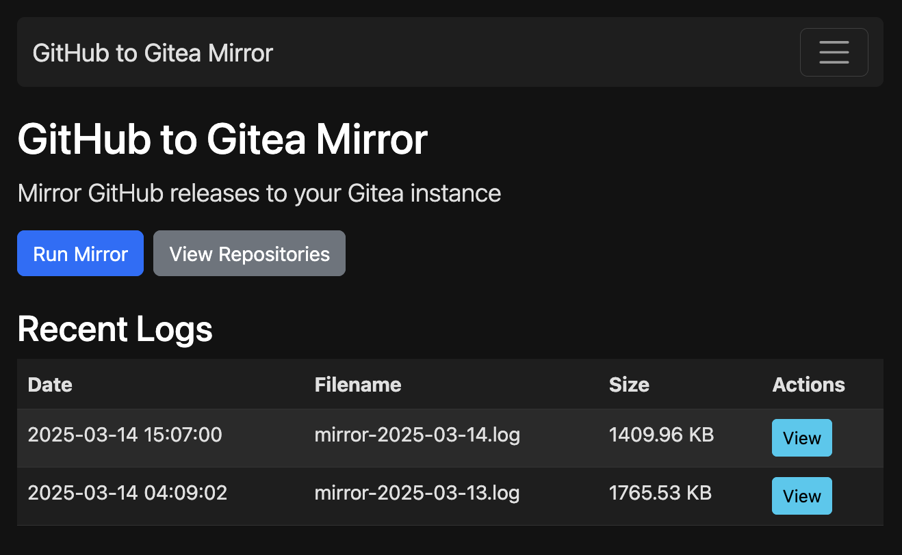
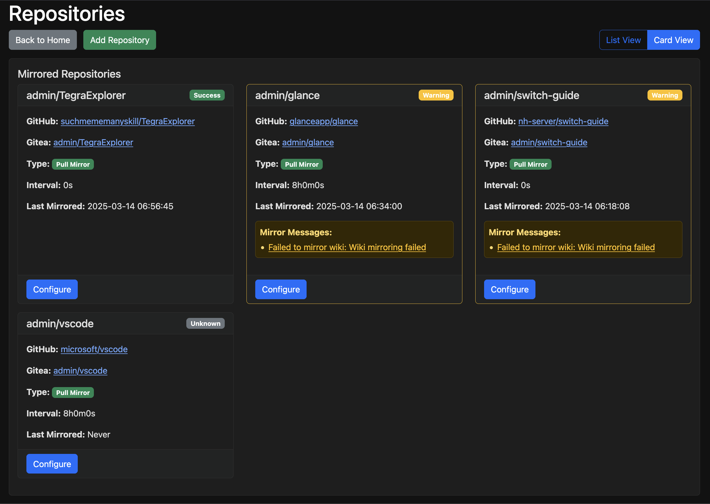
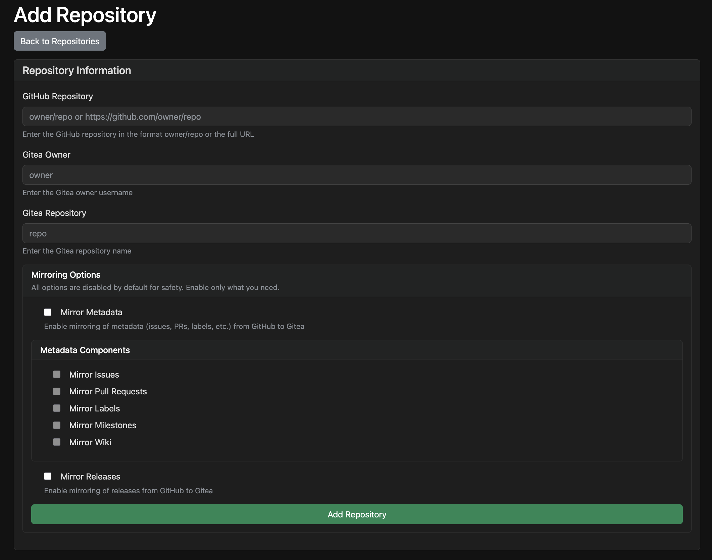
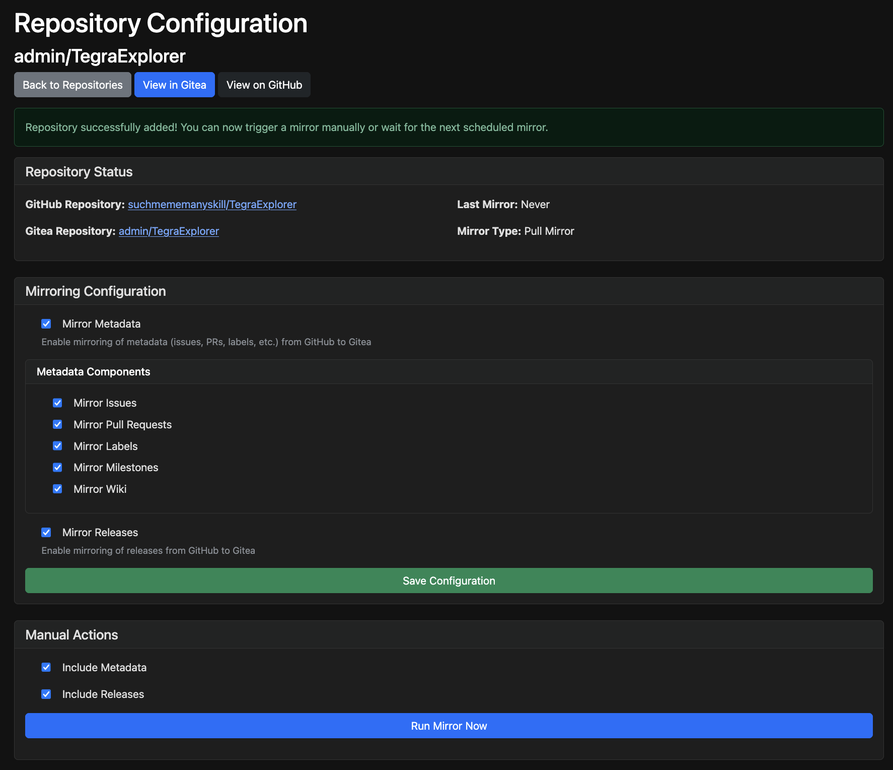
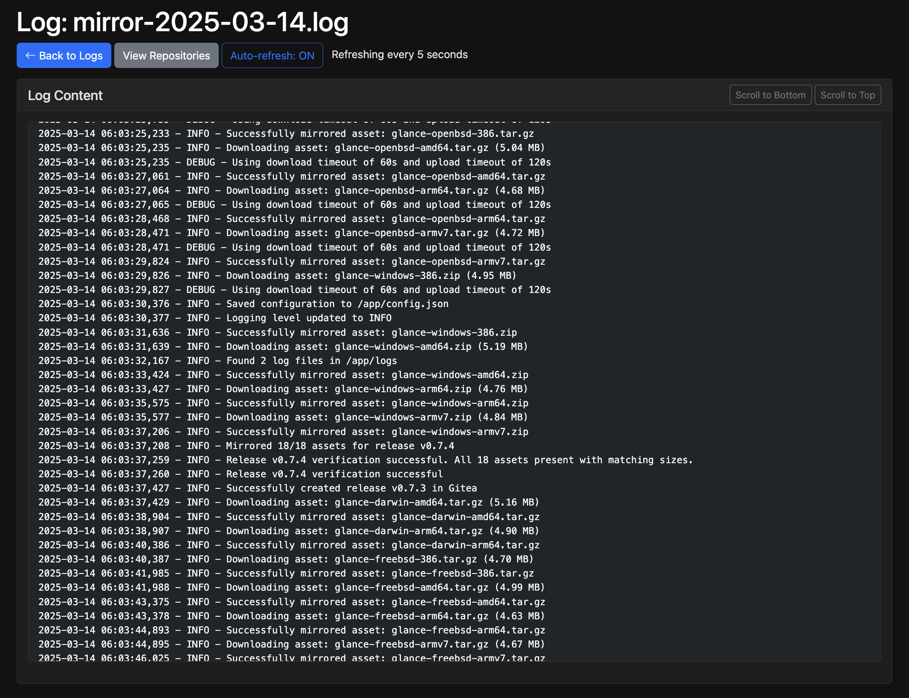

# GitHub to Gitea Mirror

This tool sets up and manages pull mirrors from GitHub repositories to Gitea repositories, including the entire codebase, issues, PRs, releases, and wikis.

I've been eagerly awaiting [Gitea's PR 20311](https://github.com/go-gitea/gitea/pull/20311) for over a year, but since it keeps getting pushed out for every release I figured I'd create something in the meantime. 

> **Blunt disclaimer:** This is a hobby project, and I hope the PR above will be merged and implemented soon. When it is, this project will have served its purpose. I created it from scratch using [Cursor](https://cursor.com/) and [Claude 3.7 Sonnet](https://www.anthropic.com/claude/sonnet).



## Features

- Web UI for managing mirrors and viewing logs [screens and more info](#web-ui)
- Set up GitHub repositories as pull mirrors in Gitea
- Mirror the entire codebase, issues, and PRs (not just releases)
- Mirror GitHub releases and release assets with full descriptions and attachments
- Mirror GitHub wikis to separate Gitea repositories
- Auto-discover mirrored repositories in Gitea
- Support for both full GitHub URLs and owner/repo format
- Comprehensive logging with direct links to logs from error messages
- Support for large release assets with dynamic timeouts
- Asset download and upload with size-based timeout calculation
- Scheduled mirroring with configurable interval
- Enhanced UI with checkboxes for configuration options
- Dark mode support
- Error handling and visibility

## Quick Start

Get up and running in minutes:

```bash
# Clone the repository
git clone https://github.com/jonasrosland/gitmirror.git
cd gitmirror

# Copy and configure the example .env file
cp .env.example .env
# Edit the .env file with your tokens and Gitea URL

# Start the application
docker-compose up -d

# Access the web UI
# Open http://localhost:5000 in your browser
```

## Prerequisites

- Docker and Docker Compose (for running the application)
- GitHub Personal Access Token with `repo` scope
- Gitea Access Token with `read:user`, `write:repository`, and `write:issue` scopes
- Access to both GitHub and Gitea repositories

## Configuration

Create a `.env` file in the same directory as the docker-compose.yml with the following variables:

```env
# GitHub Personal Access Token (create one at https://github.com/settings/tokens)
# Required scopes: repo (for private repositories)
# For public repositories, this is optional but recommended
GITHUB_TOKEN=your_github_token

# Gitea Access Token (create one in your Gitea instance under Settings > Applications)
# Required permissions: read:user, write:repository, write:issue
GITEA_TOKEN=your_gitea_token

# Your Gitea instance URL (no trailing slash)
GITEA_URL=https://your-gitea-instance.com

# Secret key for the web UI (OPTIONAL)
# This key is used to secure Flask sessions and flash messages
# If not provided, a random key will be automatically generated at container start
# SECRET_KEY=your_secret_key
```

### Authentication for Private Repositories

If you want to mirror private GitHub repositories, you must provide a GitHub token with the `repo` scope. This token is used to authenticate with GitHub when creating the mirror.

For public repositories, the GitHub token is optional but recommended to avoid rate limiting issues.

## Usage

### Using Docker Compose (Recommended)

For easier deployment, you can use Docker Compose:

1. Start the web UI:
```bash
docker-compose up -d
```

2. Run the mirror script (one-time execution):
```bash
docker-compose run --rm mirror
```

3. Run the mirror script for a specific repository:
```bash
docker-compose run --rm mirror mirror owner/repo gitea_owner gitea_repo
```

4. Run with specific flags:
```bash
# Enable mirroring metadata (issues, PRs, labels, milestones, wikis)
docker-compose run --rm mirror mirror --mirror-metadata

# Force recreation of empty repositories (required when an existing repository is empty but not a mirror)
docker-compose run --rm mirror mirror --force-recreate

# Combine flags for a specific repository
docker-compose run --rm mirror mirror owner/repo gitea_owner gitea_repo --mirror-metadata --force-recreate
```

5. View logs:
```bash
docker-compose logs -f
```

6. Stop the services:
```bash
docker-compose down
```

### Using Docker Directly

To run the application with Docker directly:

1. Build the Docker image:
```bash
docker build -t github-gitea-mirror .
```

2. Run the container:

   a. Run the web UI (default mode):
   ```bash
   docker run --rm -p 5000:5000 --env-file .env github-gitea-mirror
   ```

   b. Run the mirror script in auto-discovery mode:
   ```bash
   docker run --rm --env-file .env github-gitea-mirror mirror
   ```

   c. Run the mirror script for a specific repository:
   ```bash
   docker run --rm --env-file .env github-gitea-mirror mirror owner/repo gitea_owner gitea_repo
   ```
   
   d. Run with the force-recreate flag (for empty repositories):
   ```bash
   docker run --rm --env-file .env github-gitea-mirror mirror owner/repo gitea_owner gitea_repo --force-recreate
   ```

3. For persistent storage of logs, mount a volume:
   ```bash
   docker run --rm -p 5000:5000 -v ./logs:/app/logs --env-file .env github-gitea-mirror
   ```

### How Mirroring Works

When you set up a repository for mirroring, the script performs several types of synchronization:

1. **Code Mirroring**: Uses Gitea's built-in pull mirror functionality to sync:
   - The entire codebase
   - All branches and tags
   > NOTE: This is done automatically at creation of the mirror repo, and sometimes it takes a while for Gitea to finish the first code sync
     

2. **Release Mirroring**: Uses custom code to sync:
   - Releases and release assets
   - Release descriptions and metadata
   - Release attachments with proper naming and descriptions

3. **Metadata Mirroring**: Syncs additional GitHub data:
   - Issues and their comments
   - Pull requests and their comments
   - Labels and milestones
   - Wiki content (if enabled)

The process works as follows:

1. The script checks if the repository exists in Gitea
2. If it exists and is already a mirror:
   - It triggers a code sync
   - It only mirrors releases and metadata if those options are explicitly enabled in the repository configuration
3. If it exists but is not a mirror:
   - If the target repository is empty, it requires explicit confirmation via the `--force-recreate` flag used with the CLI command (see below) before deleting and recreating it as a mirror
   - If the target repository has commits, it warns you that you need to to delete it manually
4. If it doesn't exist, it creates a new repository as a mirror
5. After setting up the mirror, it triggers a code sync in Gitea
6. It only mirrors releases, issues, PRs, and other metadata if those options are enabled in the repository configuration

By default, all mirroring options (metadata, releases, etc.) are disabled for safety. You can enable them through the web UI's repository configuration page or by using the appropriate command-line flags.

### Repository Safety

The tool includes safety measures to prevent accidental data loss:

1. **Empty Repository Protection**: When an existing repository is empty but not configured as a mirror, the tool will not automatically delete and recreate it without explicit confirmation via the `--force-recreate` flag.

2. **Non-Empty Repository Protection**: If a repository contains commits, the tool will never attempt to delete it, even with the `--force-recreate` flag. This ensures that repositories with actual content are never accidentally deleted.

3. **Explicit Confirmation**: The `--force-recreate` flag serves as an explicit confirmation that you want to delete and recreate empty repositories as mirrors, providing an additional safety layer against accidental data loss.

4. **CLI-Only Operation**: The `--force-recreate` flag is deliberately available only through the command-line interface and not through the web UI. This design choice prevents accidental repository deletion through misclicks in the web UI and ensures that repository recreation is a deliberate, intentional action that requires specific command knowledge.

This multi-layered approach to safety ensures that repositories are protected from accidental deletion while still providing the flexibility to recreate empty repositories when necessary.

### Wiki Mirroring

When mirroring a GitHub repository with a wiki, the tool creates a separate repository for the wiki content. This is necessary because:

1. **Gitea's Limitations**: Gitea's repository mirroring feature doesn't automatically mirror the wiki repository. Wikis in Git are actually separate repositories (with `.wiki.git` suffix).

2. **Read-Only Constraint**: For mirrored repositories in Gitea, the wiki is read-only and cannot be directly pushed to, which prevents direct mirroring of wiki content.

The mirroring process for wikis works as follows:

1. The tool checks if the GitHub repository has a wiki
2. It verifies that git is installed in the container (this is handled automatically)
3. If a wiki exists, it clones the GitHub wiki repository
4. It creates a new repository in Gitea with the name `{original-repo-name}-wiki`
5. It pushes the wiki content to this new repository
6. It updates the main repository's description to include a link to the wiki repository

This approach ensures that all wiki content from GitHub is preserved and accessible in Gitea, even for mirrored repositories.

### Web UI

The web UI provides a user-friendly interface for managing mirrors and viewing logs:

1. Access the web UI by navigating to `http://localhost:5000` in your browser after starting the Docker container

2. Use the web interface to:
   - View mirrored repositories in list or card view
   - Run mirrors manually
   - View logs with auto-refresh functionality (updates every 5 seconds)
   - Configure scheduled mirroring with a customizable interval
   - Configure repository-specific mirroring options

3. The UI features:
   - Dark mode support
   - Checkboxes for configuration options
   - Direct links to logs from error messages
   - Color-coded status indicators
   - Responsive design for mobile and desktop

#### Repository List View



#### Adding a Repository



#### Repository Configuration



#### Log Viewer



### Repository Configuration

Each repository can be individually configured with the following options:

1. **Mirror Metadata**: Enable/disable mirroring of metadata (issues, PRs, labels, etc.)
   - Mirror Issues: Sync GitHub issues to Gitea
   - Mirror Pull Requests: Sync GitHub PRs to Gitea
   - Mirror Labels: Sync GitHub labels to Gitea
   - Mirror Milestones: Sync GitHub milestones to Gitea
   - Mirror Wiki: Sync GitHub wiki to a separate Gitea repository

2. **Mirror Releases**: Enable/disable mirroring of GitHub releases to Gitea

These options can be configured through the repository configuration page, accessible by clicking the "Configure" button for a repository in the repositories list.

### Error Handling and Logging

The application provides comprehensive logging and error handling:

1. **Log Files**: All mirror operations are logged to date-based log files in the `logs` directory
2. **Error Visibility**: Errors and warnings are prominently displayed in the UI with appropriate color coding
3. **Direct Log Links**: Error messages are clickable and link directly to the relevant log file
4. **Status Indicators**: Repositories with errors or warnings are visually highlighted in both list and card views

When an error occurs during mirroring, you can click on the error message to view the detailed log, which helps in diagnosing and resolving issues.

## Logs

Logs are stored in the `logs` directory with a date-based naming convention. The web UI provides a convenient way to view these logs, with direct links from error messages.

## Development and Testing

### Setting Up for Development

1. Install test dependencies:
   ```bash
   pip install -r test-requirements.txt
   ```

2. Run all tests:
   ```bash
   ./run-tests.sh
   ```

3. Run specific test categories:
   ```bash
   # Run unit tests
   python -m pytest tests/unit -v
   
   # Run integration tests
   python -m pytest tests/integration -v
   
   # Run with coverage report
   python -m pytest --cov=gitmirror --cov-report=term-missing
   ```

### Test Suite Structure

The test suite is organized into several categories:

1. **Unit Tests** (`tests/unit/`): Tests individual components in isolation
   - `test_github_api.py`: Tests GitHub API functionality
   - `test_gitea_repository.py`: Tests Gitea repository operations
   - `test_gitea_api.py`: Tests Gitea API functionality
   - `test_cli.py`: Tests command-line interface
   - `test_mirror.py`: Tests core mirroring functionality
   - `test_web.py`: Tests web interface routes and functionality
   - `test_imports_and_modules.py`: Tests module imports and basic functionality

2. **Integration Tests** (`tests/integration/`): Tests interactions between components
   - `test_mirror_integration.py`: Tests the integration of mirroring components

3. **Configuration Tests** (`tests/test_config.py`): Tests configuration loading and saving

### Test Coverage

All tests are now passing. The current test coverage is 27%, with most of the coverage in the core functionality:

- GitHub API module: 86% coverage
- CLI module: 84% coverage
- Gitea repository module: 58% coverage
- Config utilities: 54% coverage
- Issue module: 42% coverage
- Metadata module: 32% coverage

Areas with lower coverage include:
- Web interface: 16% coverage
- PR module: 2% coverage
- Comment module: 24% coverage
- Wiki module: 11% coverage

### Mocking Strategy

The tests use extensive mocking to avoid external dependencies:

1. **API Requests**: All HTTP requests are mocked using `unittest.mock.patch` to avoid actual API calls
2. **File System**: File operations are mocked or use temporary directories
3. **Environment Variables**: Environment variables are mocked to provide test values
4. **Configuration**: Configuration loading and saving are mocked to avoid file system dependencies

### Running Tests in Docker

You can also run the tests inside a Docker container:

```bash
docker-compose run --rm web python -m pytest
```

This ensures tests run in an environment similar to production.

## Code Structure

The codebase has been structured as a modular package for better maintainability:

- `gitmirror/`: Main package
  - `github/`: GitHub API interactions
  - `gitea/`: Gitea API interactions, organized into focused modules:
    - `repository.py`: Repository management functions
    - `release.py`: Release management functions
    - `issue.py`: Issue management functions
    - `pr.py`: Pull request management functions
    - `comment.py`: Comment management functions
    - `wiki.py`: Wiki management functions
    - `metadata.py`: Labels, milestones, and other metadata functions
  - `utils/`: Utility functions
    - `logging.py`: Logging setup and utilities, including log file management
    - `config.py`: Configuration management utilities
  - `mirror.py`: Main mirroring logic
  - `cli.py`: Command-line interface
  - `web.py`: Web UI

This modular organization improves code maintainability, makes it easier to locate specific functionality, and allows for more focused testing and development.

## License

This project is licensed under the MIT License - see the LICENSE file for details.

## Known Limitations

- **Large Repositories**: Very large repositories with many issues, PRs, or releases may take a long time to mirror initially.
- **Rate Limiting**: GitHub API rate limits may affect mirroring performance for frequent updates or large repositories.
- **Authentication**: The application currently only supports personal access token authentication.
- **Webhooks**: The tool does not currently support automatic mirroring via webhooks; scheduled mirroring is used instead.
- **Bidirectional Sync**: This is a one-way mirror from GitHub to Gitea; changes made in Gitea are not synced back to GitHub.

## Contributing

Contributions are welcome! If you'd like to contribute to this project:

1. Fork the repository
2. Create a feature branch (`git checkout -b feature/amazing-feature`)
3. Commit your changes (`git commit -m 'Add some amazing feature'`)
4. Push to the branch (`git push origin feature/amazing-feature`)
5. Open a Pull Request

Please make sure to update tests as appropriate and follow the existing code style.